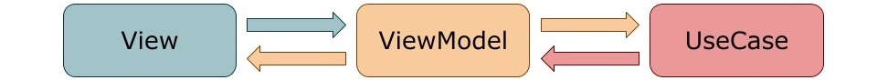
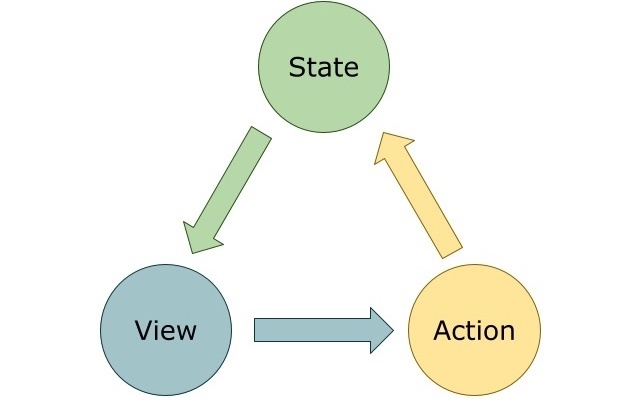
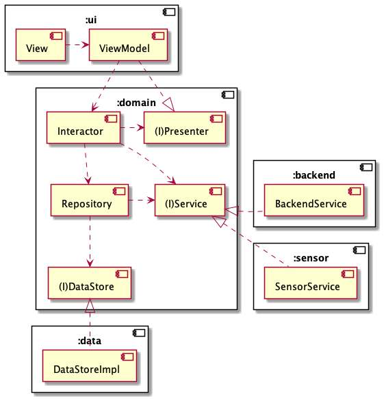
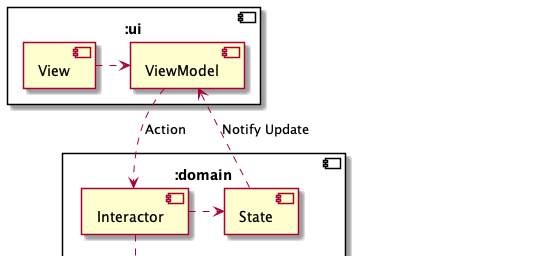
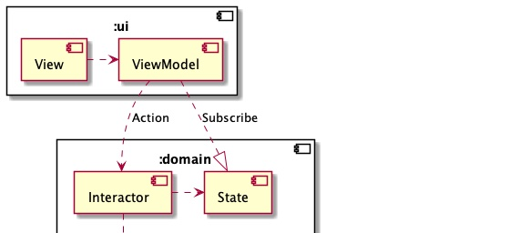
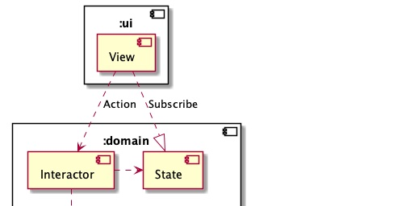
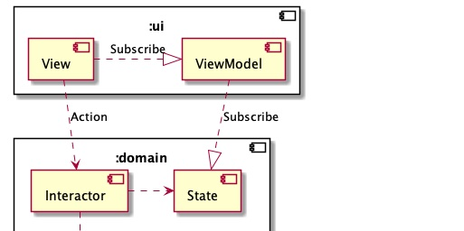

# Flowでクリーンアーキテクチャーを最適化する

## はじめに

弊社の一部チームでは、モバイルアプリ開発にクリーンアーキテクチャーを採用しています。プロジェクトが大きくなって新しい人が介入しても、基本の設計ポリシーが保たれるという利点があります。

しかし、モジュールやクラスの多さに伴ってデータの流れがわかりにくいのは、クリーンアーキテクチャー採用前と比べてあまり変わっていないようです。

本書の前半では、クリーンアーキテクチャーの思想を守りつつ、データの流れをわかりやすくするためにKotlin Coroutines Flowを用いてUnidirectional Data Flow（以下、単方向データフロー）のロジックを実装します。

そして後半では、そのロジックをKotlin Multiplatform Mobileのフレームワークとしてアプリに組み込みます。Kotlinを標準サポートするAndroidアプリではなく、あえてSwiftUIベースのiOSアプリを選び、X-Platformへの適合を確認します。また、KotlinのFlowがSwiftにはどんな形で流れるのか、単方向データフローやConcurrencyは保たれるのか、お楽しみの終盤展開となっています。

なお、クリーンアーキテクチャーの概要は、本書では触れていません。[ACCESSテックブック](https://access-company.github.io/techbookfest/techbookfest7/ACCESS_techbook_ebook_20190922.pdf)第1章、もしくは数ある書籍や検索をご参照ください。

## 単方向データフロー

まず、単方向データフローについて説明します。

Web Frontendの方には馴染み深いと思いますが、2010年代のモバイルアプリ開発ではTwo-way data binding（以下、双方向データバインディング）が主流でした。特にAndroidはData BindingやView Bindingが公式から出ておりその傾向は顕著で、iOSもRx系を使って擬似的or結果的に双方向を実現しているケースが多いです。

ですが、2020年代に入ってSwiftUI/CombineやJetpack Composeなどの導入が進み、WebのFlux系に似たような単方向データフローが浸透し始めています。ここでは、主にモバイル開発者向けにそれを一度おさらいします。

### 双方向データバインディングとは

単方向データフローと対の概念である双方向データバインディングとは、ある値がユーザー→Viewの入力に連動し、また通信結果などにも連動している状態のことです。値はViewModelに置かれることが多いです。

このように各境界が双方向に繋がっており、UseCaseの変更がViewに、Viewの変更がUseCaseに伝播しやすく、責務を分割しながらコードを整理できるのが特徴です。

見かけのコード量は少なくできますが、各境界でのデータ型の変換や、ビューパーツごとにバインディングするための実装が必要になるため、全体のコード量は減らしづらい性質があります。

### 単方向データフローとは

かたや単方向データフローは、ユーザーがViewに与えた変更をActionとして受け取り、値は直接更新しません。 Actionはロジックを経てStateを更新し、StateがViewに描画されるというサイクルの関係です。

単方向データフローでは、データは常に同じ方向へ流れ、逆流は許されません。ActionはViewからの命令、StateはActionの結果、そしてViewはStateの結果です。

### 単方向にするメリットとは

一見すると、双方向のほうが便利そうで、階層化されているためとっつきやすい印象です。しかし、単方向化には色々とメリットがあります。

1. 単一化/カプセル化...MutableなStateが複数箇所に散らばるのを防ぐ。双方向の場合、どこに置くかは曖昧である
2. 共有...1つのStateを複数の子Viewで使いまわしやすい。双方向の場合もできるが、Viewを越えて共有するための実装が複雑化する
3. 分離...Stateが更新されたときの影響を最小限に留められる。双方向の場合、スレッドなどの考慮が必要。データの流れが単方向なら、切り出しや拡張が容易で、デバッグやテストもしやすい

もちろんメリットだけでなく、単方向化のデメリットも存在します。

1. 単一化/カプセル化...MutableなStateが1箇所なので、適用できるデザインパターンが限られる
2. 共有...Viewライフサイクルの細かい考慮が必要。開いていないViewのStateまでメモリ上に持つのは理想的ではない
3. 分離...Viewのコード量、コンポーネントが増える。パーツごとに描画用のVariableと入力のListenerを毎回書く必要がある。MVVMやMVCに慣れた人が理解しづらかったり、プロジェクトごとに実装スタイルの差が出やすい

### Androidアプリの変化

Androidアプリの場合、今までは[@BindingAdapter](https://developer.android.com/topic/libraries/data-binding/two-way?hl=ja#two-way-custom-attrs)がよく使われており、推奨アーキテクチャがMVVMなことからも、双方向データバインディングが暗黙的に推奨されていたと言えます。

これはアプリ規模が大きくなるにつれ、アプリ独自のバインディングが多数実装されることを意味しました。やりすぎるとブラックボックス化が起きたり、Android初心者にとって学習ハードルが高い部分でした。

また、接続がアノテーション任せな上に双方向なので、デバッグやバグ調査がしづらい問題もありました。

2021年7月、待望のJetpack Composeが登場し、[単方向データフロー](https://developer.android.com/jetpack/compose/architecture?hl=ja#udf-compose)が公式推奨されました。これを導入すると、UIからStateを直接変えれなくなるため、先述の複雑性からある程度解放されます。

また、デメリットの1つであるライフサイクル問題も、remember宣言子によってStateの生存期間をViewライフサイクルに合わせられるので回避できます。

### iOSアプリの変化

iOSアプリは、MVCやMVC+VMのようなアーキテクチャがよく使われてきました。

しかし、Rx系をふんだんに使わないとあっという間にControllerが肥大化したり、外部のフレームワークに頼らざるをえないのが積年の問題でした。一部をRouterに切り出したり、VIPERを導入したりなどの模索が続きました。

2019年、Swift UI/Combineが登場し、こちらも単方向データフローが公式サポートのスタート地点に立ちました。非公式ですが[TCA](https://qiita.com/tonionagauzzi/items/a97a7303b546e515fc9b)も登場し、着々と置き換えが進んでいる印象です。

## クリーンアーキテクチャーと単方向データフロー

続いて、クリーンアーキテクチャーと単方向データフローの親和性に関する考察です。

domainから他へインターフェースを提供し、「この通りに実装して結果をください」（to backend, data, sensor）、「Presenter型のオブジェクトを作ってくれれば結果を代入します」（to UI）とし、domainから他への依存を無くすのが、改善前のクリーンアーキテクチャーの特徴です。

そのクリーンアーキテクチャーのデータの流れを、本章でわかりやすくしていきます。

### PresenterをStateに置き換え

Presenterを採用していると、ActionからViewに戻るまでのルートを自由に決めれるので、私の参画してる案件でもApplicationやAppDelegateなんかがPresenterを継承して、データの行き先がよくわからなくなってるロジックが多少ありました。

そのPresenterをやめ、UIからdomainに渡すものをAction、domainからUIにはStateの更新を通知するようにしてみます。

図1.2っぽくなりました。ところが、このままではクリーンアーキテクチャーに反しています。Notify Updateのところで、UIがdomainに依存しているからです。

これは、UI側からStateをSubscribeすることで回避可能です。

さて、データの流れはViewとViewModelの間にもあります。

ViewModelからViewへは、依存こそありませんが、データは流れます。つまり、ViewとViewModel間のデータの流れはまだ双方向です。このままでは、ViewModelのテストがしづらいです。

### 結局ViewModelは必要なのか

思いきってViewModelを取ってみました。すると、Viewに以下の責務が集中します。

1. 画面の表示
2. Stateの監視
3. Stateから画面パーツ向けの型変換
4. 画面の更新
5. 画面遷移

これなら、2と3をViewModelとして分けてた方がまだ読みやすいでしょうし、テストのしにくさに至っては悪くなっています。

では、Viewからのイベント発火で直接interactorを呼び、ViewModelは上記2と3に専念させればどうでしょうか。

スッキリした気がしますね。

この場合のViewModelは、SubscribeしたデータをView向けに変換してViewに送り出す役割ですが、iOSの[TCA](https://qiita.com/tonionagauzzi/items/a97a7303b546e515fc9b)ではViewStore、[Unio](https://github.com/cats-oss/Unio)ではViewStreamと呼ばれています。

ViewModelという呼び方が適切かどうかは諸説ありつつ、コンバーターとしての役割はViewから切り離したほうがよいと私は考えます。

## Kotlin Coroutines Flow

執筆中

## Kotlin Multiplatform MobileでUI以外を実装する

執筆中

## SwiftUIにKMMを取り込む

執筆中
